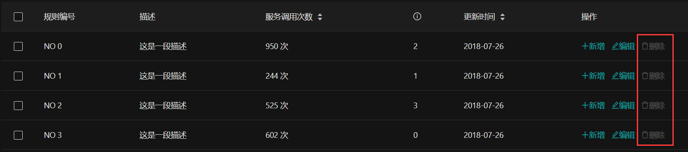

# 권한 관리
권한 제어는 중간 및 백그라운드 시스템의 공통 요구 사항 중 하나이며 
Vue Antd Admin에서 제공하는 권한 제어 스캐폴딩을 사용하여 몇 가지 기본 권한 제어 기능을 구현할 수 있습니다.

## 역할 및 권한
일반적으로 사용자 권한을 제어하는 ​​두 가지 방법이 있습니다. 
하나는 사용자 역할을 통해 권한을 제어하는 ​​것이고 다른 하나는 보다 세부적인 권한을 통해 권한을 제어하는 ​​것입니다.
이 두 가지 방법 모두 Vue Antd Admin에서 지원됩니다.
역할과 권한의 기본 형식을 정의해 놓았는데, Vue Antd Admin과 사용자가 받는 역할과 권한의 데이터 형식이 일치하지 않을 경우,
역할과 권한을 받은 후 Vue Antd Admin 형식으로 변환해야 합니다.
### 역할
Vue Antd Admin의 `role`에는 `id`와 `operation`의 두 가지 속성이 있습니다. 여기서 `id`는 `role/role`의 id이고, `operation`은 문자열 배열인 `role/role`의 작업 권한입니다.
```js
role = {
  id: 'admin',                                   //역할 ID
  operation: ['add', 'delete', 'edit', 'close']  //역할의 작업 권한
}
```
다음과 같은 `role = 'admin'`과 같은 문자열로 역할을 설정할 수도 있습니다.
```js
role = {
  id: 'admin'
}
```
### 허가
Vue Antd Admin의 'permission'에는 'id'와 'operation'이라는 두 가지 속성도 포함되어 있습니다. 
여기서 `id`는 `permission/permission`의 id이고 `operation`은 문자열 배열인 `permission/permission` 아래의 작업 권한입니다.
```js
permission = {
  id: 'form',                                    //권한 ID
  operation: ['add', 'delete', 'edit', 'close']  //권한 아래의 작업 권한
}
```
또한 권한을 문자열로 설정할 수 있습니다(예: permission = 'form'). 이는 다음과 같습니다.
```js
permission = {
  id: 'form'
}
```
### 사용자 역할 및 권한 설정
사용자가 권한 관리 기능을 완료하려면 역할과 권한 중 하나만 설정하면 됩니다. 물론 둘 다 구성할 수도 있습니다.
사용자 권한 또는 역할을 얻은 후 Vue Antd Admin에서 사용할 수 있는 형식으로 포맷한 다음 
`store.commit('account/setPermissions', 권한)` 또는 `store.commit('account/setRoles', roles )`를 사용합니다.
로컬에 저장하면 됩니다. 다음과 같이:
```js
getPermissions().then(res => {
  const permissions = res.data
  this.$store.commit('account/setPermissions', permissions)
})
getRoles().then(res => {
  const roles = res.data
  this.$store.commit('account/setRoles', roles)
})
```
:::tip
로컬에 존재하는 권한과 역할은 모두 배열이여야 합니다.
`/pages/login/Login.vue`에서 사용자 역할 및 권한 설정을 위한 전체 코드를 볼 수 있습니다.
:::
## 페이지 권한
일부 페이지에 대한 접근 권한을 설정하려면 해당 페이지에 해당하는 경로에 대한 메타데이터 권한만 설정하면 됩니다. 
권한 값은 문자열 또는 개체일 수 있습니다. 

다음 라우팅 구성은 `인증 페이지`에 권한이 필요함을 나타냅니다. `form`
```js {5}
const route = {
  name: '인증 페이지',
  path: 'auth/demo',
  meta: {
    authority: 'form',
  },
  component: () => import('@/pages/demo')
}
```
다음은 권한 값을 객체로 쓰는 방법으로 위 문자열의 쓰기 방법과 동일한 효과를 갖는다.：
```js {5-7}
const route = {
  name: '인증 페이지',
  path: 'auth/demo',
  meta: {
    authority: {
      permission: 'form'
    }
  },
  component: () => import('@/pages/demo')
}
```
때때로 사용자 역할을 통해 페이지 권한을 구성해야 할 수 있으며 당사에서도 이를 지원하며 사용법은 위와 유사합니다.  

다음 구성은 `인증 페이지`에 `admin` 액세스 역할(역할)이 필요함을 나타냅니다.
```js {5-7}
const route = {
  name: '인증 페이지',
  path: 'auth/demo',
  meta: {
    authority: {
      role: 'admin'
    }
  },
  component: () => import('@/pages/demo')
}
```
:::tip
권한을 설정하지 않거나 권한 값을 `*`로 설정하면 해당 페이지에 권한 제한이 필요하지 않음을 의미하며 이 페이지에 대한 권한 검사는 무시합니다.
:::
:::tip
권한 값이 문자열인 경우 [권한/권한](#권한)으로 권한을 확인합니다. [role/role](#role)로 권한을 인증해야 하는 경우 권한 값을 객체 형식으로 설정하십시오.
:::
## 운영 권한
일부 복잡한 시나리오에서는 권한이 페이지 수준만큼 간단하지 않을 수 있습니다. 
일부 페이지에서는 사용자에게 추가, 삭제, 수정, 확인 등과 같은 특정 작업에 대한 권한이 있는지 확인해야 할 수 있습니다.
이를 위해 '권한 확인 주입'과 '권한 확인 지시어'라는 두 가지 유용한 기능을 제공합니다.
### 권한 확인 주입
Vue 컴포넌트의 인스턴스 메소드에 '권한 검증 주입'을 수행함으로써 인스턴스 메소드의 실행 권한을 제어하여 사용자의 동작을 정확하고 안전하게 검증할 수 있습니다.

예를 들어 QueryList 페이지의 deleteRecord 메소드에서 `delete` 작업 권한을 가진 사용자가 이 메소드를 호출할 수 있기를 바랍니다.
`deleteRecord` 메소드에 대한 권한 검사를 삽입하고 다음과 같이 `authorize`를 구성하십시오.
```vue {9-11,13}
<template>
  ...
</template>
<script>
...
export default {
  name: 'QueryList',
  data () {...},
  authorize: {              //권한 확인 주입 설정
    deleteRecord: 'delete'  //키는 권한 검사에 삽입해야 하는 메서드의 이름이고, 여기에는 deleteRecord 메서드가 있고, 값은 확인해야 하는 작업 권한이고, 여기에는 삭제 작업 권한이 있습니다.
  },
  methods: {
    deleteRecord(key) {
      this.dataSource = this.dataSource.filter(item => item.key !== key)
      this.selectedRows = this.selectedRows.filter(item => item.key !== key)
    },
    ...
  }
}
</script>
```
사용자에게 `delete` 권한이 없는 경우 deleteRecord 메소드를 호출하면 다음 프롬프트가 표시됩니다.


### 작업 권한 확인 유형
`authorize`는 현재 페이지와 일치하는 권한 유형([permission](#authority) / [role](#role))에 따라 권한 확인을 위해 `permission.operation` 또는 `role.operation`을 사용할지 여부를 결정합니다.
현재 페이지가 권한 및 역할 권한 모두와 일치하는 경우 기본적으로 권한 확인에 권한.작업이 사용됩니다.

물론 다음과 같이 작업 권한 확인 유형을 지정할 수도 있습니다.
```js {2-5}
authorize: {             
  deleteRecord: {        //권한 검사에 삽입해야 하는 메소드 이름: deleteRecord
    check: 'delete',     //확인이 필요한 작업 권한: 확인
    type: 'role'         //작업 권한 확인 유형, 선택적 권한 및 역할을 지정합니다. 여기서 role.operation을 사용하여 작업 권한을 확인하도록 지정됩니다.
  }
}
```
### 권한 확인 명령
때때로 우리는 사용자가 자신의 운영 권한을 보다 직관적으로 이해하기를 원할 수 있습니다. 
예를 들어 작업 권한이 없는 컨트롤에 비활성화 스타일을 적용하거나 클릭 이벤트를 비활성화하는 등의 작업을 수행합니다.
이 기능을 수행하기 위해 권한 확인 명령 `v-auth`를 제공합니다.

예를 들어 QueryList 페이지에서 삭제 컨트롤에 대한 `delete` 작업 권한을 확인하려면 다음과 같이 삭제 컨트롤에 대해 v-auth="\`delete\`" 명령만 설정하면 됩니다.
```vue {6}
<template>
  <a-card>...
    <standard-table ...>
      ...
      <div slot="action" slot-scope="{text, record}">
        <a @click="deleteRecord(record.key)" v-auth="`delete`">
          <a-icon type="delete" />삭제
        </a>
      </div>
      ...
    </standard-table>
  </a-card>
</template>
```
사용자에게 `delete` 작업 권한이 없으면 컨트롤이 비활성화 스타일로 적용되고 아래 표시된 것처럼 클릭 이벤트가 무효화됩니다.


:::warning 확인！！！
v-auth는 사용자 정의 [Vue 지시문](https://cn.vuejs.org/v2/guide/custom-directive.html#ad)입니다. 'Vue 지시어'의 값은 자바스크립트 표현식이어야 하므로 v-auth를 문자열로 직접 할당할 수 없으며,
v-auth의 문자열 값은 ``` `로 감싸야 합니다. 그렇지 않으면 정의되지 않은 오류가 보고될 수 있습니다.
:::
### 권한 확인 안내의 종류
또한 v-auth의 권한 확인 유형, 선택 사항인 [permission](#permission) 및 [role](#role)을 지정할 수 있습니다. 
검증 방식은 [권한 부여](#권한 부여 검증 주입)와 유사하며, 지정하지 않으면 자동으로 인식된다.
'v-auth:role'은 'role.operation'을 통한 확인을 의미하고, 'v-auth:permission'은 'permission.operation'을 통한 확인을 의미합니다.
 
다음과 같이 `role.operation` 검증을 통해 컨트롤을 삭제하는 작업 권한을 지정합니다.
```vue {3}
<div slot="action" slot-scope="{text, record}">
  ...
  <a v-auth:role="`delete`">
    <a-icon type="delete" />삭제
  </a>
  ...
</div>
```
## 비동기 라우팅 권한
비동기 라우팅은 메타데이터 속성 메타에 [권한](#페이지 권한)을 설정하지 않아도 된다는 점을 제외하면 기본적으로 일반 라우팅 권한 설정과 동일한 권한 검증 설정을 수행할 수 있다.
권한은 라우팅 컴포넌트가 등록될 때 설정하거나 비동기 라우팅 구성에서 설정할 수 있습니다.  

라우팅 컴포넌트 등록 시 설정 [authority](#페이지권한)：
```js {6}
// 라우팅 구성 요소 등록
const routerMap = {
  ...
  demo: {
    name: '데모 페이지',
    authority: 'form',
    component: () => import('@/pages/demo')
  }
  ...
}
```

비동기 라우팅 구성 설정 [authority](#페이지권한)：
```js {11-13}
const routesConfig = [{
    router: 'root',
    children: ['demo',
      {router: 'parent1'...},
      ...
      {
        router: 'demo',
        icon: 'file-ppt',
        path: 'auth/demo',
        name: '인증 페이지',
        authority: {
          permission: 'form',
        }
      }
    ]
  }]
```
