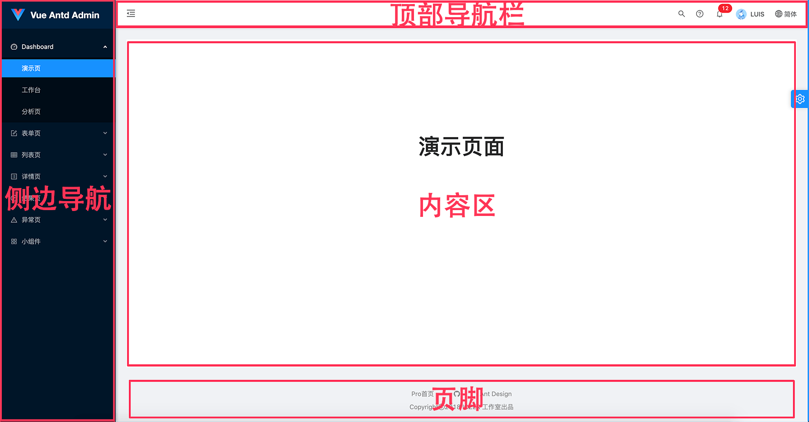
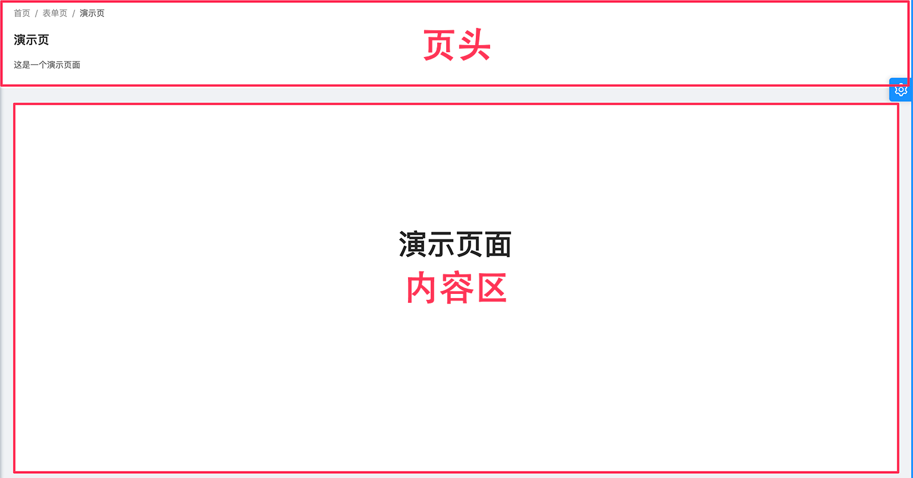
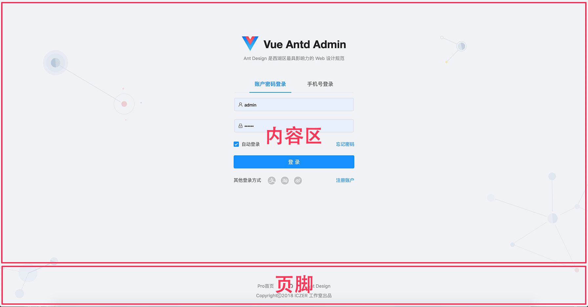
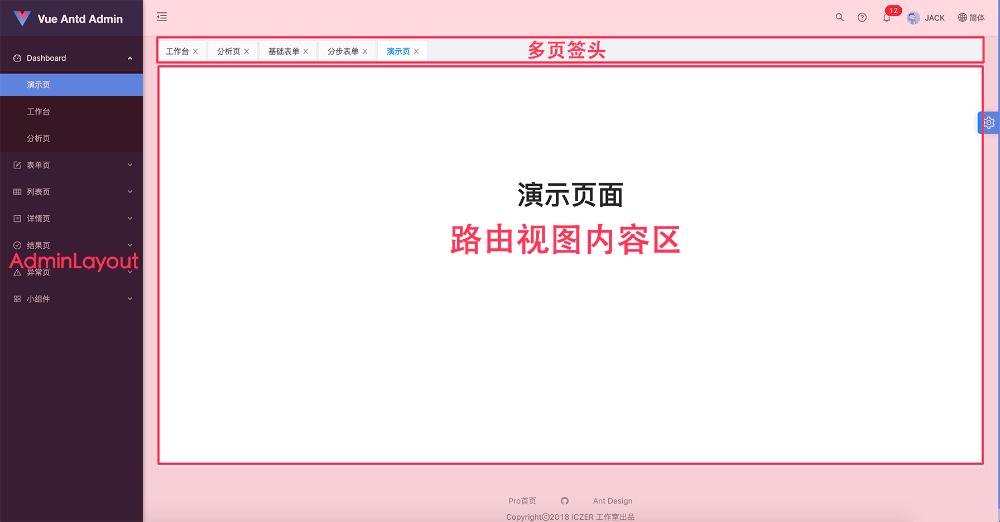
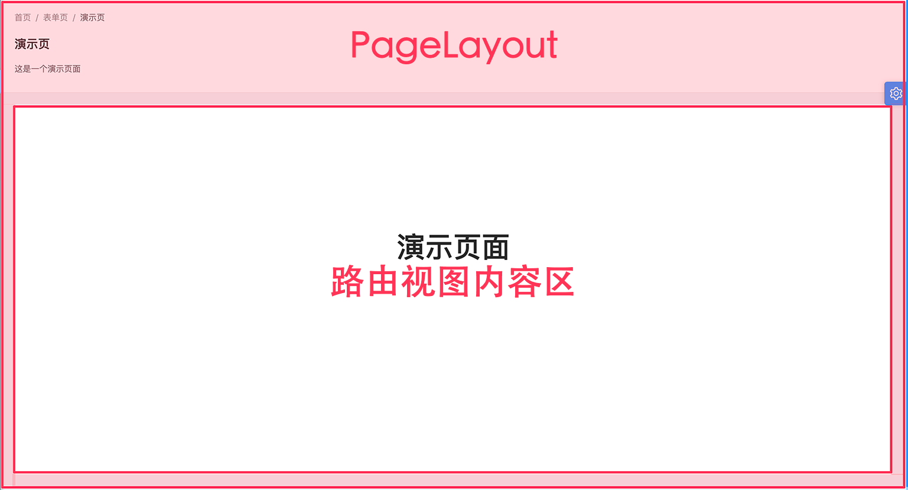
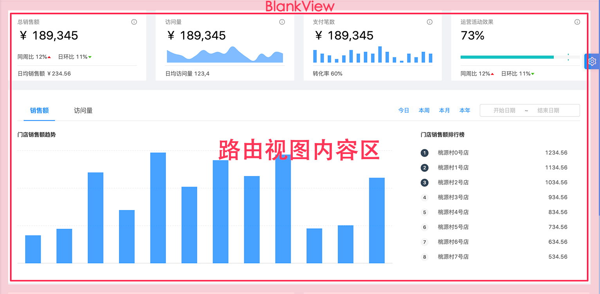

# 레이아웃
전체 페이지 레이아웃은 탐색, 바닥글, 사이드바, 알림 표시줄 및 콘텐츠를 포함하는 제품의 가장 바깥쪽 프레임 구조입니다. 페이지에는 많은 블록 레이아웃 구조도 있습니다. 실제 프로젝트에서 페이지 레이아웃은 일반적으로 전체 애플리케이션의 인터페이스를 제어하며 매우 중요한 역할을 합니다.

## 관리자 레이아웃
Vue Antd Admin에서 사용하는 동안 몇 가지 일반적인 레이아웃을 추출하여 다음과 같은 레이아웃 디렉토리에 배치했습니다.
* [AdminLayout](https://github.com/iczer/vue-antd-admin/blob/master/src/layouts/AdminLayout.vue) / **관리 배경 레이아웃**, 헤드 탐색, 측면 탐색, 콘텐츠 포함 일반적으로 백엔드 시스템의 전체 레이아웃에 사용되는 영역 및 바닥글


* [PageLayout](https://github.com/iczer/vue-antd-admin/blob/master/src/layouts/PageLayout.vue) / **페이지 레이아웃**, 페이지 헤더 및 콘텐츠 영역이 포함되며, 헤더가 필요한 페이지에 자주 사용됩니다(이동 경로, 제목, 추가 작업 등 포함).


* [CommonLayout](https://github.com/iczer/vue-antd-admin/blob/master/src/layouts/CommonLayout.vue) / **Universal Layout**, 콘텐츠 영역과 바닥글만 포함하는 단순한 레이아웃으로 프로젝트의 등록, 로그인 또는 표시 페이지에 자주 사용됩니다.


## 관리자 보기
Vue Antd Admin에는 기본 레이아웃 외에도 일반적으로 유사한 구조의 페이지가 많이 있습니다. 따라서 구조의 이 부분을 뷰 구성 요소로 추출합니다.
보기 컴포넌트는 일반적으로 라우팅 구성과 함께 자주 사용되는 기본 레이아웃 컴포넌트, 보기 공통 블록, 라우팅 보기 콘텐츠 영역, 바닥글 등을 포함합니다. 다음과 같이 레이아웃 디렉토리에도 배치됩니다.
* [TabsView](https://github.com/iczer/vue-antd-admin/blob/master/src/layouts/TabsView.vue) / **다중 탭 보기**, AdminLayout 레이아웃, 다중 탭 헤더 및 라우팅 보기 콘텐츠 영역 포함


* [PageView](https://github.com/iczer/vue-antd-admin/blob/master/src/layouts/PageView.vue) / **페이지 보기**, PageLayout 레이아웃 및 라우팅 보기 콘텐츠 영역 포함


* [BlankView](https://github.com/iczer/vue-antd-admin/blob/master/src/layouts/BlankView.vue) / **빈 보기**, 라우팅 보기 콘텐츠 영역만 포함


## 사용하는 방법
일반적으로 보기 구성 요소와 라우팅 구성을 함께 사용하고 라우팅 구성 파일에서 구성 정보를 추출합니다. [src/router/config.js](https://github.com/iczer/vue-antd-admin/blob/master/src/router/config.js) 。如下：
```jsx {7,12}
{
  path: 'form',
  name: '表单页',
  meta: {
    icon: 'form',
  },
  component: PageView,
  children: [
    {
      path: 'basic',
      name: '基础表单',
      component: () => import('@/pages/form/basic/BasicForm'),
    }
  ]
}
```
물론 이것이 요구 사항을 충족하지 않는 경우 일부 보기 구성 요소를 사용자 지정하거나 페이지 구성 요소에서 직접 레이아웃을 사용할 수도 있습니다. 인용하다
[workplace](https://github.com/iczer/vue-antd-admin/blob/master/src/pages/dashboard/workplace/WorkPlace.vue) 페이지:
```vue {2,13}
<template>
  <page-layout :avatar="currUser.avatar">
    <div slot="headerContent">
      <div class="title">{{$t('timeFix')}}，{{currUser.name}}，{{$t('welcome')}}</div>
      <div>{{$t('position')}}</div>
    </div>
    <template slot="extra">
      <head-info class="split-right" :title="$t('project')" content="56"/>
      <head-info class="split-right" :title="$t('ranking')" content="8/24"/>
      <head-info class="split-right" :title="$t('visit')" content="2,223"/>
    </template>
    <div>...</div>
  </page-layout>
</template>
```
## 기타 레이아웃 구성 요소
Admin의 기본 제공 레이아웃 외에도 레이아웃이 필요한 일부 페이지에서는 Ant Design Vue: Grid and Layout에서 제공하는 레이아웃 구성 요소를 사용할 수도 있습니다.
### 그리드 컴포넌트
Grid 레이아웃은 웹 페이지에서 가장 많이 사용되는 레이아웃으로, 페이지를 일정 비율로 분할하고 화면이 변해도 비율을 유지하는 것이 특징이므로 유연한 레이아웃의 특징을 가지고 있습니다.

Ant Design Vue의 그리드 컴포넌트는 보다 강력한 기능을 제공하며, 간격 설정, 반응형 스케일 설정, 기본적으로 대부분의 레이아웃 시나리오를 커버하는 플렉스 모드를 지원합니다.：[Grid](https://www.antdv.com/components/grid-cn/)。
### 레이아웃 구성 요소
페이지 프레임 수준의 레이아웃 디자인을 지원해야 하는 경우 레이아웃이 최선의 선택입니다. 대부분의 프레임 레이아웃 구조를 추상화하므로 공백을 채우는 것만으로 표준화되고 전문적인 전체 페이지 레이아웃을 개발할 수 있습니다. 세부：[Layout](https://www.antdv.com/components/layout-cn/)。
### 다양한 시나리오에 따라 레이아웃 구성 요소 구별
대부분의 시나리오에서 일반 탐색, 사이드바, 상단 알림, 페이지 제목 및 기타 요소를 포함하여 위의 두 구성 요소를 기반으로 현재 특정 비즈니스에 적합한 일부 구성 요소를 캡슐화해야 합니다. 예를 들어 Vue Antd Admin의 [AdminLayout](https://github.com/iczer/vue-antd-admin/blob/master/src/layouts/AdminLayout.vue)。  
 
일반적으로 쉽게 관리할 수 있도록 추상화된 레이아웃 구성 요소를 레이아웃 폴더에 넣습니다. 이러한 레이아웃 구성 요소는 우리가 일반적으로 사용하는 다른 구성 요소와 다르지 않지만 레이아웃 문제를 처리하기 위해 기능적으로 별도로 분류됩니다.
