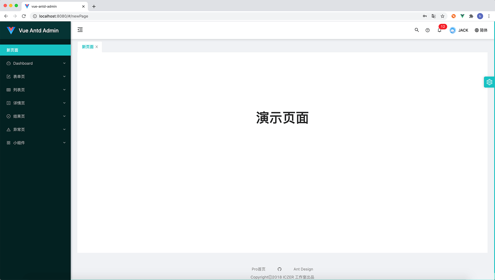
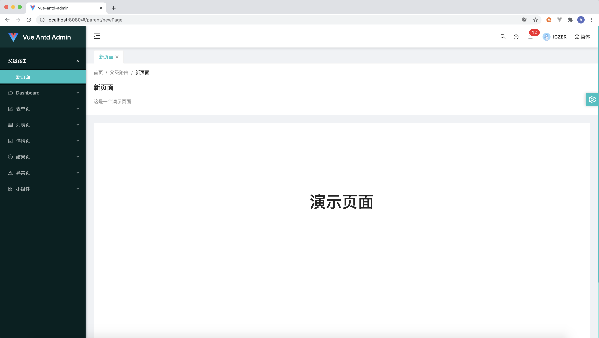
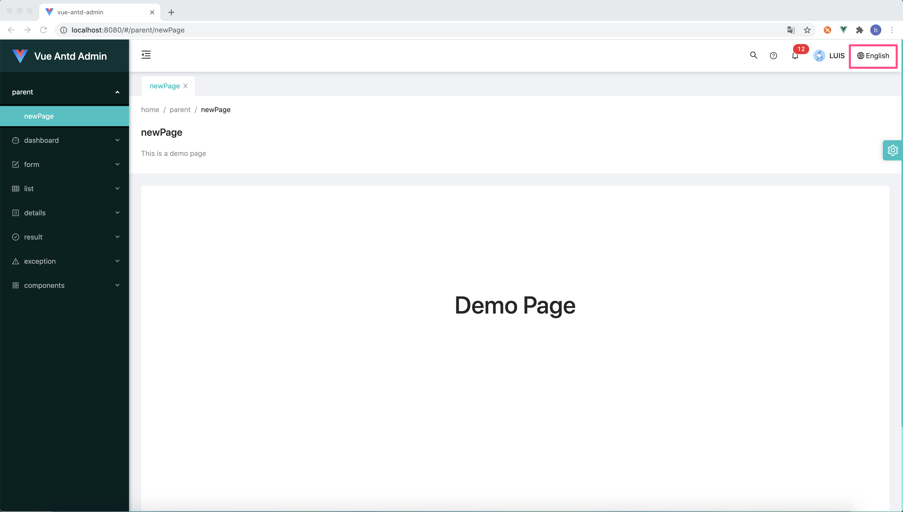

# 페이지
여기서 "페이지"에는 새 페이지 파일, 구성 라우팅, 스타일 파일 및 i18n 국제화가 포함됩니다. 일반적으로 간단한 구성으로 새 페이지를 추가할 수 있습니다.
## 새 페이지 파일
src/pages 아래에 새 .vue 파일을 만듭니다. 페이지 관련 파일이 너무 많으면 폴더를 만들어 보관할 수 있습니다.
```diff                    
  ├── public
  ├── src
  │   ├── assets               # 로컬 정적 리소스
  :   :
  │   ├── pages                # 페이지 구성 요소 및 일반 템플릿
+ │   │   └── NewPage.vue      # 새 페이지 파일
or
+ │   │   └── newPage          # 새 페이지에 대한 폴더 만들기
+ │   │       ├── NewPage.vue  # 새 페이지 파일
+ │   │       ├── index.less   # 페이지 스타일 파일
+ │   │       └── index.js     # 부트스트랩 파일 가져오기
  :   :
  │   └── main.js              # 애플리케이션 엔트리 js
  ├── package.json             # package.json
  ├── README.md                # README.md
  └── vue.config.js            # vue 구성 파일
```
더 나은 데모를 위해 다음과 같이 NewPage.vue 파일을 초기화합니다.：
```vue
<template>
  <div class="new-page" :style="`min-height: ${pageMinHeight}px`">
    <h1>데모 페이지</h1>
  </div>
</template>
<script>
  import {mapState} from 'vuex'
  export default {
    name: 'NewPage',
    data() {
      return {
        desc: '데모 페이지입니다.'
      }
    },
    computed: {
      ...mapState('setting', ['pageMinHeight']),
    }
  }
</script>
<style scoped lang="less">
@import "index.less";
</style>
```
index.less 문서:
```less
.new-page{
  height: 100%;
  background-color: @base-bg-color;
  text-align: center;
  padding: 200px 0 0 0;
  margin-top: -24px;
  h1{
    font-size: 48px;
  }
}
```
index.js 문서:
```js
import NewPage from './NewPage'
export default NewPage
```
## 라우팅 구성
라우팅 설정은 src/router/config.js 파일에 있으며, 위에서 생성한 페이지 파일을 라우팅 설정에 추가합니다.
```js {10-14}
const options = {
  routes: [
    {name: '로그인 페이지'...},
    {
      path: '/',
      name: '첫 페이지',
      component: TabsView,
      redirect: '/login',
      children: [
        {
          path: 'newPage',
          name: '새 페이지',
          component: () => import('@/pages/newPage'),
        },
        {
          path: 'dashboard',
          name: 'Dashboard',
          meta: {
            icon: 'dashboard'
          },
          component: BlankView,
          children: [...]
        }
      ]
      ...
    }
  ]
}
```
:::tip
경로의 경로 속성을 영어로 설정하고 경로의 이름 속성을 중국어로 설정하는 것이 좋습니다. 시스템이 자동으로 경로의 경로와 이름 속성을 국제화 구성으로 추출하기 때문입니다. 이것은 나중 챕터에서
 [고급>국제화](../advance/i18n.md)를 언급합니다.
  물론 프로젝트에 국제화가 필요하지 않은 경우 무시할 수 있습니다.
:::
서비스를 시작하면 다음과 같은 새 페이지가 표시됩니다.

두 번째 수준 페이지 이상으로 구성하려면 해당 페이지에 대해 상위 경로를 구성하고 상위 경로에 대해 [구성 요소 보기]를 구성하기만 하면 됩니다.(./layout.md#admin-관점)，
여기에서 [PageView]를 선택합니다.(https://github.com/iczer/vue-antd-admin/blob/master/src/layouts/PageView.vue), 다음과 같이:
```js {10-21}
const options = {
  routes: [
    {name: '로그인 페이지'...},
    {
      path: '/',
      name: '첫 페이지',
      component: TabsView,
      redirect: '/login',
      children: [
        {
          path: 'parent',
          name: '상위 경로',
          component: PageView,
          children: [
            {
              path: 'newPage',
              name: '새 페이지',
              component: () => import('@/pages/newPage'),
            }
          ]
        },
        {name: 'dashboard'...}
      ]
      ...
    }
  ]
}
```
:::warning
페이지의 모든 상위 경로 구성 요소는 다음과 같이 구성해야 합니다.[보기 구성 요소](../develop/layout.md#admin-的视图), 그렇지 않으면 페이지의 내용이 표시되지 않을 수 있습니다.  
 [PageView](https://github.com/iczer/vue-antd-admin/blob/master/src/layouts/PageView.vue)、
[TabsView](https://github.com/iczer/vue-antd-admin/blob/master/src/layouts/tabs/TabsView.vue)
[BlankView](https://github.com/iczer/vue-antd-admin/blob/master/src/layouts/BlankView.vue) 선택 과목,
보기 구성 요소를 직접 만들 수도 있습니다.（[보기 구성 요소 란 무엇입니까?](../develop/layout.md#admin-的视图)）
:::
페이지는 다음과 같습니다.

## i18n 국제화 구성
페이지에 i18n 국제화 구성을 추가하려면 페이지의 동일한 수준 폴더 아래에 생성하기만 하면 됩니다. i18n.js 파일을 가져온 다음 페이지 파일에서 가져와 사용합니다.  
i18n.js 파일 생성：
```diff {9}                    
  ├── public
  ├── src
  │   ├── assets               # 로컬 정적 리소스
  :   :
  │   ├── pages                # 페이지 구성 요소 및 일반 템플릿
  │   │   └── newPage        # 새 페이지에 대한 폴더 만들기
  │   │       ├── NewPage.vue  # 새 페이지 파일
  │   │       ├── index.less   # 페이지 스타일 파일
+ │   │       ├── i18n.js      # i18n 국제화 프로필
  │   │       └── index.js     # import 부팅 파일
  :   :
  │   └── main.js              # 애플리케이션 엔트리 js
  ├── package.json             # package.json
  ├── README.md                # README.md
  └── vue.config.js            # vue 구성 파일
```
i18n.js 문서 내용:
```js
module.exports = {
  messages: {
    CN: {
      content: '데모 페이지',
      description: '데모 페이지입니다.'
    },
    HK: {
      content: '데모 페이지',
      description: '데모 페이지입니다.'
    },
    US: {
      content: 'Demo Page',
      description: 'This is a demo page'
    }
  }
}
```
NewPage.vue 파일에 i18n.js를 도입하고 국제화해야 할 내용을 추가합니다. 다음과 같이 수정：
```vue {3,10,13-15}
<template>
  <div class="new-page" :style="`min-height: ${pageMinHeight}px`">
    <h1>{{$t('content')}}</h1>
  </div>
</template>
<script>
  import {mapState} from 'vuex'
  export default {
    name: 'NewPage',
    i18n: require('./i18n'),
    computed: {
      ...mapState('setting', ['pageMinHeight']),
      desc() {
        return this.$t('description')
      }
    }
  }
</script>
<style scoped lang="less">
@import "index";
</style>
```
그런 다음 페이지 오른쪽 상단의 언어 항목에서 ``영어``를 선택하면 페이지 언어가 영어로 전환된 것을 확인할 수 있습니다. 다음과 같이：

모든 것이 너무 간단합니다!
:::tip
기존 언어로 전환하려고 하면 ``페이지 제목``과 ``이동 경로``가 영어로 표시될 수 있습니다.
여기에는 라우팅의 국제화 구성이 포함되며 [고급 > 국제화](../advance/i18n.md) 장에서 자세히 설명합니다.
:::
