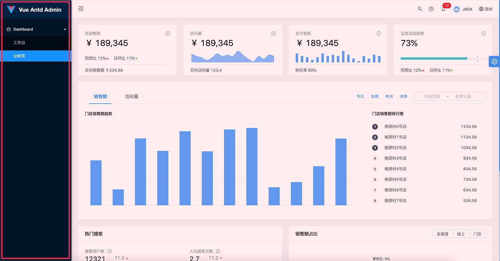

# 라우팅 및 메뉴
라우팅 및 메뉴는 애플리케이션 구성을 위한 핵심 골격 역할，Vue Antd Admin 사용 [vue-router](https://router.vuejs.org/zh/) 경로와 메뉴를 구성하고 관리합니다.
## 기본 구조
vue-router 라우팅 구성의 확장성 덕분에 Vue Antd Admin은 라우터 구성 파일, 기본 알고리즘 및 [menu.js](https://github.com/iczer/vue-antd-admin/blob/master/src/components/menu/menu.js) 메뉴 생성 도구는 주로 다음 모듈/기능을 포함하는 라우팅 및 메뉴의 기본 프레임워크를 구축합니다.：

|특징        |구성                            |
|:----------|:-------------------------------|
|*경로 관리*  |[vue-router](https://router.vuejs.org/zh/)의 라우팅 규칙을 통해 관리 및 구성|
|*메뉴 생성*  |메뉴는 라우팅 구성에 따라 자동으로 생성되며 메뉴 항목 이름, 아이콘 및 레벨은 라우팅 구성을 통해 모두 사용자 정의할 수 있습니다.|
|*빵 부스러기*    |레이아웃 구성 요소 [PageLayout](https://github.com/iczer/vue-antd-admin/blob/master/src/layouts/PageLayout.vue) 현재 페이지 경로를 추출하고 현재 라우팅 계층에 따라 이동 경로를 자동으로 생성합니다. 물론 이동 경로를 사용자 정의할 수도 있습니다.|
|*페이지 제목*  |이동 경로, 레이아웃 구성 요소와 동일 [PageLayout](https://github.com/iczer/vue-antd-admin/blob/master/src/layouts/PageLayout.vue) 현재 페이지의 추출된 경로 이름에 따라 페이지 제목을 설정하고 제목을 사용자 정의할 수도 있습니다|

## 라우팅
Vue Antd Admin의 라우팅 구성은 vue-router의 라우팅 구성을 완전히 따릅니다. [routes 규칙 구성](https://router.vuejs.org/zh/api/#routes)。
Vue Antd Admin의 라우팅 구성은 vue-router의 라우팅 구성을 완전히 따릅니다. routes 메타데이터 속성 [meta](https://router.vuejs.org/zh/guide/advanced/meta.html#%E8%B7%AF%E7%94%B1%E5%85%83%E4%BF%A1%E6%81%AF) 메뉴와 헤더를 생성하는 역할을 하는 3가지 속성 아이콘, 보이지 않는 페이지와 에 삽입된 페이지가 있습니다. 구성 예는 다음과 같습니다：
```js {7,13}
const options = {
  routes: [{
    path: '/',
    name: '첫 페이지',
    component: TabsView,
    meta: {
      invisible: true
    },
    children: [{
      path: 'dashboard',
      name: 'Dashboard',
      meta: {
        icon: 'dashboard'
      },
      component: BlankView,
      children: [{
        path: 'workplace',
        name: '작업대',
        component: () => import('@/pages/dashboard/workplace/WorkPlace'),
      }, {
        path: 'analysis',
        name: '분석 페이지',
        component: () => import('@/pages/dashboard/analysis/Analysis'),
      }]
    }]
  }]
}
```
전체 구성 예는 다음을 참조하십시오. [src/router/config.js](https://github.com/iczer/vue-antd-admin/blob/master/src/router/config.js)

## 메뉴
Admin 시스템의 메뉴는 라우팅 구성을 통해 직접 생성되며, 라우팅 속성과 메뉴 기능 간의 해당 관계는 다음과 같습니다.

|경로 속성|해당 메뉴 기능|
|:-----------------|:-------|
|**name**          |메뉴 이름 |
|**path**          |메뉴 클릭 시 링크 이동|
|**meta.icon**     |메뉴 아이콘, 아이콘 사용 ant-design-vue 아이콘 라이브러리, 해당 [Icon](https://www.antdv.com/components/icon-cn/#API) 구성 요소의 유형 속성|  
|**meta.invisible**|이 라우팅 항목을 메뉴 항목으로 렌더링할지 여부, 기본값은 false입니다. true, 이 경로는 메뉴를 생성할 때 무시됩니다.|

위의 [Route](#Route) 문서에서 [Configuration Example](#Route)을 사용하면 다음과 같은 메뉴가 생성됩니다.：


실제 프로젝트에서는 AdminLayout 구성 요소가 생성되기 전에 라우터 구성의 루트 경로 '/' 아래의 모든 하위 경로 구성을 추출합니다.
그리고 이 구성을 메뉴를 생성하는 menu.js 플러그인에 전달합니다. 다음과 같이：
```vue {4,12,13,14}
<template>
  <a-layout :class="['admin-layout'...]">
    ...
    <side-menu :menuData="menuData".../>
  </a-layout>
</template>
<script>
import ...
export default {
  name: 'AdminLayout',
  ...
  beforeCreate () {
    menuData = this.$router.options.routes.find((item) => item.path === '/').children
  }
}
</script>
```
자세한 코드를 볼 수 있습니다 [layouts/AdminLayout#L83](https://github.com/iczer/vue-antd-admin/blob/master/src/layouts/AdminLayout.vue#L83)。  
물론 라우터 구성을 사용하지 않고 메뉴를 생성할 수도 있으며, 구성 규칙에 따라 정의한 구성을 메뉴에 전달하기만 하면 됩니다. 메뉴 구성 요소 구성 규칙은 다음과 같습니다.：
```jsx {}
[{
  name: '메뉴 제목',
  path: '메뉴 라우팅',
  meta: {
    icon: '메뉴 아이콘',
    invisible: 'boolean, 이 메뉴 항목을 숨길지 여부, 기본값 false',
  },
  children: [ //하위 메뉴 구성
    {
      name: '하위 메뉴 제목',
      path: '하위 메뉴 라우팅',
      meta: {
        icon: '하위 메뉴 아이콘',
        invisible: 'boolean, 이 메뉴 항목을 숨길지 여부, 기본값 false',
      },
    }
  ]
}]
```
자세한 내용을 볼 수 있습니다 [components/menu/menu.js](https://github.com/iczer/vue-antd-admin/blob/master/src/components/menu/menu.js)

## 빵 부스러기
빵 부스러기 [PageHeader](https://github.com/iczer/vue-antd-admin/blob/master/src/components/page/PageHeader.vue) 구현된 PageLayout 구성 요소는 현재 페이지 경로에서 이동 경로 구성을 추출합니다(설정되지 않은 경우 현재 경로 계층 구조를 기반으로 이동 경로를 생성합니다). 따라서 페이지가 PageLayout 레이아웃을 사용하거나 부모 구성 요소가 PageLayout 레이아웃을 사용하는 한 이동 경로가 자동으로 생성됩니다.

물론 페이지에서 이동 경로를 사용자 지정하려면 해당 라우팅 메타데이터 메타에 page.breadcrumb 속성을 정의하기만 하면 됩니다. Vue Antd Admin은 기본적으로 경로 메타데이터 메타에 정의된 이동 경로 구성을 사용합니다.  

예를 들어 워크벤치 페이지의 이동 경로를 사용자 지정하려면 워크벤치의 경로 구성에서 다음을 설정할 수 있습니다.
```jsx {5,6,7}
{
  path: 'workplace',
  name: '작업대',
  meta: {
    page: {
      breadcrumb: ['첫 페이지', 'Dashboard', '사용자 정의']
    }
  },
  component: () => import('@/pages/dashboard/workplace/WorkPlace'),
}
```
자세한 내용을 볼 수 있습니다 [layouts/PageLayout.vue#L55](https://github.com/iczer/vue-antd-admin/blob/master/src/layouts/PageLayout.vue#L55)
## 페이지 제목
페이지 제목의 구현은 기본적으로 이동경로와 동일하며 PageLayout 컴포넌트는 현재 페이지 경로에서 제목을 추출합니다(설정하지 않으면 현재 경로 이름이 제목으로 추출됨)）。 
 
페이지 제목을 사용자 정의하려면 해당 페이지에 해당하는 라우팅 메타데이터 메타에 page.title 속성을 정의하십시오. 다음 예제에서는 워크벤치 페이지의 제목을 정의합니다.：
```jsx {5,6,7}
{
  path: 'workplace',
  name: '작업대',
  meta: {
    page: {
      title: '사용자 정의 제목'
    }
  },
  component: () => import('@/pages/dashboard/workplace/WorkPlace'),
}
```
자세한 내용을 볼 수 있습니다 [layouts/PageLayout.vue#L48](https://github.com/iczer/vue-antd-admin/blob/master/src/layouts/PageLayout.vue#L48)
