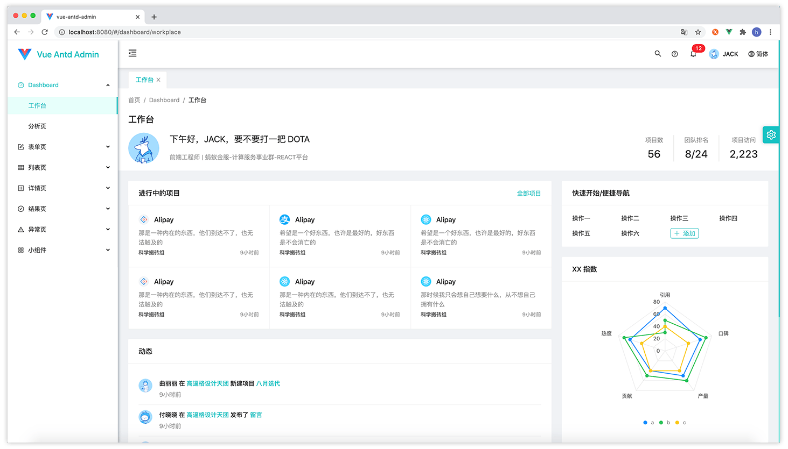
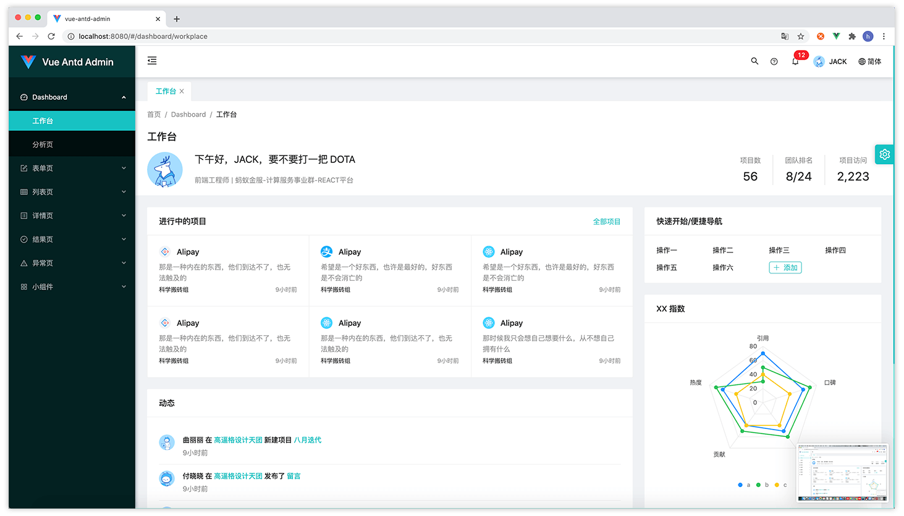
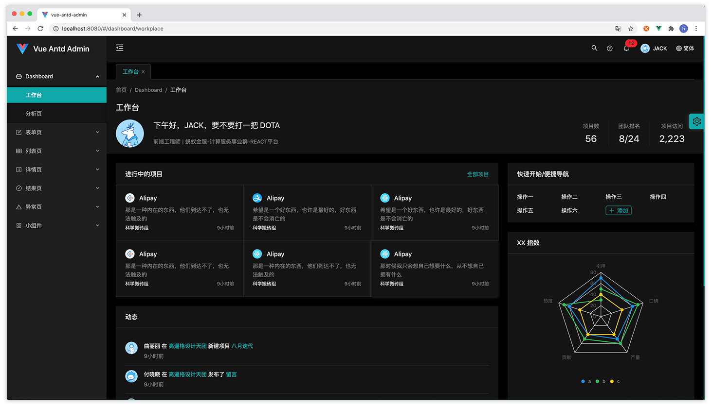

# 테마 사용자 정의

## 테마 색상
### 테마 색상
선택할 수 있는 내장 컬러 휠이 있습니다. 

<color color="#fa541c"/>
<color color="#fadb14"/>
<color color="#3eaf7c"/>
<color color="#13c2c2"/>
<color color="#1890ff"/>
<color color="#722ed1"/>
<color color="#eb2f96"/>

그것이 당신의 요구를 충족시키지 못한다면, 당신이 좋아하는 모든 색상을 사용할 수도 있습니다. src/config/config.js 파일에서 테마 색상을 구성할 수 있습니다. 처럼:
```js {3}
module.exports = {
  theme: {
    color: '#13c2c2', //원하는 색상으로 변경, 지원 hex 색상 값
    mode: 'night'
  },
  multiPage: true,
  animate: {
    name: 'roll',
    direction: 'default'
  }
}
```
테마 색상을 설정하면 시스템에서 테마 색상을 기반으로 일련의 일치하는 색상을 생성하고 이를 vue 구성 요소에 적용합니다.
:::tip 
스타일 파일에서 less 변수를 직접 사용할 수 있습니다.``@theme-color``。
::: 
:::warning
테마 색상은 현재 ``hex`` 모드 색상 값만 지원합니다. ``rgb`` 또는 다른 색상 값 모드로 설정하면 일치하는 색상이 생성되지 않을 수 있습니다.。
:::
### 기능성 컬러
테마 색상 외에도 시스템에는 몇 가지 기능적 색상, 즉 성공 색상, 경고 색상 및 오류 색상이 있습니다. 기본 색상 값은 다음과 같습니다.
|이름|success   |warning  |error  |
|:-:|:--------:|:-------:|:-----:|
|색상 값|``#52c41a``|``#faad14``|``#f5222d``|
|색상|<color color="#52c41a"/>|<color color="#faad14"/>|<color color="#f5222d" />|
|less변수|@success-color|@warning-color|@error-color|

src/config/config.js에서 이러한 함수 색상을 재정의할 수도 있습니다.
```js {5-7}
module.exports = {
  theme: {
    color: '#13c2c2', 
    mode: 'night',
    success: '#52c41a', //성공 색상 정의, 16진수 색상 값 지원
    warning: '#faad14', //경고 색상 정의, 16진수 색상 값 지원
    error: '#f5222d'    //오류 색상 정의, 16진수 색상 값 지원
  },
  multiPage: true,
  animate: {
    name: 'roll',
    direction: 'default'
  }
}
```
:::tip
위의 기능 색상을 스타일 파일에 사용하고 싶다면 각 기능 색상에 해당하는 less 변수를 참고하면 됩니다.。
:::
:::warning
기능 색상은 현재 ``16진수`` 모드의 색상 값만 지원합니다. ``rgb`` 또는 다른 색상 값 모드로 설정하면 일치하는 색상이 생성되지 않을 수 있습니다.。
:::
### 文本色
<table style="text-align: center" >
  <tr>
    <th>테마 모드</th>
    <th>제목 색상</th>
    <th>텍스트 색상</th>
    <th>보조 텍스트 색상</th>
  </tr>
  <tr>
    <td rowspan="2">light/dark</td>
    <td><color color="rgba(0,0,0,0.85)"/></td>
    <td><color color="rgba(0,0,0,0.65)"/></td>
    <td><color color="rgba(0,0,0,0.45)"/></td>
  </tr>
  <tr>
    <td><code>rgba(0,0,0,0.85)</code></td>
    <td><code>rgba(0,0,0,0.65)</code></td>
    <td><code>rgba(0,0,0,0.45)</code></td>
  </tr>
  <tr>
    <td rowspan="2">night</td>
    <td><color color="rgba(255,255,255,0.85)"/></td>
    <td><color color="rgba(255,255,255,0.65)"/></td>
    <td><color color="rgba(255,255,255,0.45)"/></td>
  </tr>
  <tr>
    <td><code>rgba(255,255,255,0.85)</code></td>
    <td><code>rgba(255,255,255,0.65)</code></td>
    <td><code>rgba(255,255,255,0.45)</code></td>
  </tr>
  <tr>
    <td>less변수</td>
    <td>@title-color</td>
    <td>@text-color</td>
    <td>@text-color-second</td>
  </tr>
</table>

:::tip
스타일 파일에서 위의 텍스트 색상을 사용하려면 각 텍스트 색상에 해당하는 less 변수를 참조하십시오.。
:::
:::warning
현재 사용자 정의 텍스트 색상은 테마 모드 전환 시 텍스트 색상 교체를 포함하기 때문에 지원되지 않습니다. 강제로 수정하면 테마 모드 전환 시 스타일이 비정상적으로 나올 수 있습니다.
프로젝트에 테마 모드 전환이 필요하지 않은 경우 위의 텍스트 색상을 직접 바꿀 수 있습니다.
:::

### 배경색

<table style="text-align: center">
  <tr>
    <th>테마 모드</th>
    <th>레이아웃 배경색</th>
    <th>기본 배경색</th>
    <th>호버 배경색</th>
    <th>테두리 색상</th>
    <th>그림자 색</th>
  </tr>
  <tr>
    <td rowspan="2">light/dark</td>
    <td><color color="#f0f2f5"/></td>
    <td><color color="#fff"/></td>
    <td><color color="rgba(0,0,0,0.025)"/></td>
    <td><color color="#f0f0f0"/></td>
    <td><color color="rgba(0,0,0,0.15)"/></td>
  </tr>
  <tr>
    <td><code>#f0f2f5</code></td>
    <td><code>#fff</code></td>
    <td><code>rgba(0,0,0,0.025)</code></td>
    <td><code>#f0f0f0</code></td>
    <td><code>rgba(0,0,0,0.15)</code></td>
  </tr>
  <tr>
    <td rowspan="2">night</td>
    <td><color color="#000"/></td>
    <td><color color="#141414"/></td>
    <td><color color="rgba(255,255,255,0.025)"/></td>
    <td><color color="#303030"/></td>
    <td><color color="rgba(255,255,255,0.15)"/></td>
  </tr>
  <tr>
    <td><code>#000</code></td>
    <td><code>#141414</code></td>
    <td><code>rgba(255,255,255,0.025)</code></td>
    <td><code>#303030</code></td>
    <td><code>rgba(255,255,255,0.15)</code></td>
  </tr>
  <tr>
    <td>less변수</td>
    <td>@layout-bg-color</td>
    <td>@base-bg-color</td>
    <td>@hover-bg-color</td>
    <td>@border-color</td>
    <td>@shadow-color</td>
  </tr>
</table>

:::tip
위의 배경색을 스타일 파일에 사용하고 싶다면 각 배경색에 해당하는 less 변수를 참고하면 됩니다.。
:::
:::warning
현재 사용자 지정 배경색은 테마 모드 전환 시 배경색을 교체해야 하므로 지원되지 않습니다. 강제로 수정하면 테마 모드 전환 시 스타일이 비정상적으로 나올 수 있습니다.
프로젝트에 테마 모드 전환이 필요하지 않은 경우 위의 배경색을 직접 교체할 수 있습니다.
:::

### antd 컬러 시스템
위의 색상 외에도 ant-design의 내장 색상 시스템도 도입했습니다. 다음과 같이：

<table style="text-align: center">
  <tr>
    <th>컬러 시스템</th>
    <th>유형</th>
    <th>색상</th>
  </tr>
  <tr>
    <td rowspan="2">blue/새벽 블루</td>
    <td>컬러 휠</td>
    <td >
      <color-list
       :colors="['#e6f7ff', '#bae7ff', '#91d5ff', '#69c0ff', '#40a9ff', '#1890ff', '#096dd9', '#0050b3', '#003a8c', '#002766']" 
      />
    </td>
  </tr>
  <tr>
    <td>less변수</td>
    <td>
      <code>@blue-1</code>、
      <code>@blue-2</code>
      <code>...</code>
      <code>@blue-10</code>
    </td>
  </tr>
  <tr>
    <td rowspan="2">purple/소스 보라색</td>
    <td>컬러 휠</td>
    <td>
      <color-list
       :colors="['#f9f0ff', '#efdbff', '#d3adf7', '#b37feb', '#9254de', '#722ed1', '#531dab', '#391085', '#22075e', '#120338']" 
      />
    </td>
  </tr>
  <tr>
    <td>less변수</td>
    <td>
      <code>@purple-1</code>、
      <code>@purple-2</code>
      <code>...</code>
      <code>@purple-10</code>
    </td>
  </tr>
  <tr>
    <td rowspan="2">cyan/사이언</td>
    <td>컬러 휠</td>
    <td>
      <color-list
       :colors="['#e6fffb', '#b5f5ec', '#87e8de', '#5cdbd3', '#36cfc9', '#13c2c2', '#08979c', '#006d75', '#00474f', '#002329']" 
      />
    </td>
  </tr>
  <tr>
    <td>less변수</td>
    <td>
      <code>@cyan-1</code>、
      <code>@cyan-2</code>
      <code>...</code>
      <code>@cyan-10</code>
    </td>
  </tr>
  <tr>
    <td rowspan="2">green/그린</td>
    <td>컬러 휠</td>
    <td>
      <color-list
       :colors="['#f6ffed', '#d9f7be', '#b7eb8f', '#95de64', '#73d13d', '#52c41a', '#389e0d', '#237804', '#135200', '#092b00']" 
      />
    </td>
  </tr>
  <tr>
    <td>less변수</td>
    <td>
      <code>@green-1</code>、
      <code>@green-2</code>
      <code>...</code>
      <code>@green-10</code>
    </td>
  </tr>
  <tr>
    <td rowspan="2">magenta/마젠타</td>
    <td>컬러 휠</td>
    <td>
      <color-list
       :colors="['#fff0f6', '#ffd6e7', '#ffadd2', '#ff85c0', '#f759ab', '#eb2f96', '#c41d7f', '#9e1068', '#780650', '#520339']" 
      />
    </td>
  </tr>
  <tr>
    <td>less변수</td>
    <td>
      <code>@magenta-1</code>、
      <code>@magenta-2</code>
      <code>...</code>
      <code>@magenta-10</code>
    </td>
  </tr>
  <tr>
    <td rowspan="2">red/레드</td>
    <td>컬러 휠</td>
    <td>
      <color-list
       :colors="['#fff1f0', '#ffccc7', '#ffa39e', '#ff7875', '#ff4d4f', '#f5222d', '#cf1322', '#a8071a', '#820014', '#5c0011']" 
      />
    </td>
  </tr>
  <tr>
    <td>less변수</td>
    <td>
      <code>@red-1</code>、
      <code>@red-2</code>
      <code>...</code>
      <code>@red-10</code>
    </td>
  </tr>
  <tr>
    <td rowspan="2">orange/오렌지</td>
    <td>컬러 휠</td>
    <td>
      <color-list
       :colors="['#fff7e6', '#ffe7ba', '#ffd591', '#ffc069', '#ffa940', '#fa8c16', '#d46b08', '#ad4e00', '#873800', '#612500']" 
      />
    </td>
  </tr>
  <tr>
    <td>less변수</td>
    <td>
      <code>@orange-1</code>、
      <code>@orange-2</code>
      <code>...</code>
      <code>@orange-10</code>
    </td>
  </tr>
  <tr>
    <td rowspan="2">yellow/옐로우</td>
    <td>컬러 휠</td>
    <td>
      <color-list
       :colors="['#feffe6', '#ffffb8', '#fffb8f', '#fff566', '#ffec3d', '#fadb14', '#d4b106', '#ad8b00', '#876800', '#614700']" 
      />
    </td>
  </tr>
  <tr>
    <td>less변수</td>
    <td>
      <code>@yellow-1</code>、
      <code>@yellow-2</code>
      <code>...</code>
      <code>@yellow-10</code>
    </td>
  </tr>
  <tr>
    <td rowspan="2">volcano/볼케이노</td>
    <td>컬러 휠</td>
    <td>
      <color-list
       :colors="['#fff2e8', '#ffd8bf', '#ffbb96', '#ff9c6e', '#ff7a45', '#fa541c', '#d4380d', '#ad2102', '#871400', '#610b00']" 
      />
    </td>
  </tr>
  <tr>
    <td>less변수</td>
    <td>
      <code>@volcano-1</code>、
      <code>@volcano-2</code>
      <code>...</code>
      <code>@volcano-10</code>
    </td>
  </tr>
  <tr>
    <td rowspan="2">geekblue/긱블루</td>
    <td>컬러 휠</td>
    <td>
      <color-list
       :colors="['#f0f5ff', '#d6e4ff', '#adc6ff', '#85a5ff', '#597ef7', '#2f54eb', '#1d39c4', '#10239e', '#061178', '#030852']" 
      />
    </td>
  </tr>
  <tr>
    <td>less변수</td>
    <td>
      <code>@geekblue-1</code>、
      <code>@geekblue-2</code>
      <code>...</code>
      <code>@geekblue-10</code>
    </td>
  </tr>
  <tr>
    <td rowspan="2">lime/라임</td>
    <td>컬러 휠</td>
    <td>
      <color-list
       :colors="['#fcffe6', '#f4ffb8', '#eaff8f', '#d3f261', '#bae637', '#a0d911', '#7cb305', '#5b8c00', '#3f6600', '#254000']" 
      />
    </td>
  </tr>
  <tr>
    <td>less변수</td>
    <td>
      <code>@lime-1</code>、
      <code>@lime-2</code>
      <code>...</code>
      <code>@lime-10</code>
    </td>
  </tr>
  <tr>
    <td rowspan="2">gold/골드</td>
    <td>컬러 휠</td>
    <td>
      <color-list
       :colors="['#fffbe6', '#fff1b8', '#ffe58f', '#ffd666', '#ffc53d', '#faad14', '#d48806', '#ad6800', '#874d00', '#613400']" 
      />
    </td>
  </tr>
  <tr>
    <td>less변수</td>
    <td>
      <code>@gold-1</code>、
      <code>@gold-2</code>
      <code>...</code>
      <code>@gold-10</code>
    </td>
  </tr>
</table>
위의 색상 시스템에 해당하는 더 적은 변수를 스타일 코드에서 직접 사용할 수 있습니다.

:::tip
'색상 값'을 직접 사용하여 색상을 설정하는 것보다 개발 단계에서 '적은 변수'를 사용하는 것이 좋습니다. 테마 색상 및 테마 모드 전환에 유용합니다.。
:::
## 테마 모드
Vue Antd Admin에는 '밝은/밝은 메뉴 모드', '어두운/다크 메뉴 모드' 및 '야간/다크 메뉴 모드'의 세 가지 테마 모드가 있습니다.`。

light / 밝은 메뉴 모드:

dark / 어두운 메뉴 모드:

night / 야간 모드:


이 세 가지 모드 사이를 마음대로 전환할 수 있습니다. src/config/config.js 에서 기본 테마 모드를 설정합니다.
```js {4}
module.exports = {
  theme: {
    color: '#13c2c2',
    mode: 'night'       //기본 테마 모드 설정(선택 사항) light、dark , night
  },
  multiPage: true,
  animate: {
    name: 'roll',
    direction: 'default'
  }
}
```

## 탐색 레이아웃
Vue Antd Admin 두 가지 탐색 레이아웃이 있습니다.`side/측면 탐색` 그리고 `head/상단 탐색`。  
기본값은 측면 탐색이며 src/config/config.js에서 탐색 레이아웃을 수정할 수 있습니다.
```js {6}
module.exports = {
  theme: {
    color: '#13c2c2',
    mode: 'night'       
  },
  layout: 'side',     //기본 탐색 레이아웃, 측면 및 헤드(선택 사항) 설정
  multiPage: true,
  animate: {
    name: 'roll',
    direction: 'default'
  }
}
```
## 动画
Vue Antd Admin 내장 [animate.css](https://animate.style) 페이지를 전환할 때 애니메이션 효과를 적용하는 애니메이션 라이브러리입니다. src/config/config.js에서 애니메이션을 구성하거나 애니메이션을 비활성화할 수 있습니다.。
```js {7-11}
module.exports = {
  theme: {
    color: '#13c2c2',
    mode: 'night'       
  },
  multiPage: true,
  animate: {
    disabled: false,      //애니메이션 비활성화, true:비활성화，false:활성화
    name: 'roll',         //애니메이션 효과, 지원되는 애니메이션 효과는 다음을 참조하십시오. src/config/default/animate.config.js
    direction: 'default'  //애니메이션 방향, 페이지 전환 시 애니메이션 방향 참조 src/config/default/animate.config.js
  }
}
```
지원되는 애니메이션 효과 유형은 다음을 참조하십시오. src/config/default/animate.config.js 文件。
## 다른
### 색약 모드
시각 장애가 있는 그룹을 위해 다음과 같이 구성할 수 있는 색약 모드를 제공합니다. src/config/config.js 색약 모드 활성화
```js {7}
module.exports = {
  theme: {
    color: '#13c2c2',
    mode: 'night'       
  },
  multiPage: true,
  weekMode: false,   //색약 모드，true:활성화，false:비활성
  animate: {
    name: 'roll',         
    direction: 'default'
  }
}
```
### 여러 탭
src/config/config.js에서 multiPage를 설정하여 다중 탭 모드를 활성화 또는 비활성화합니다.
```js {6}
module.exports = {
  theme: {
    color: '#13c2c2',
    mode: 'night'       
  },
  multiPage: true,          //멀티탭 모드, true: 활성화, false: 비활성화
  animate: {
    name: 'roll',         
    direction: 'default'
  }
}
```
전체 시스템 설정 참조 src/config/default/setting.config.js
:::tip
위의 모든 테마 설정 항목은 vuex/setting 모듈의 상태에 매핑되었으며 설정/변이를 제출하여 실시간으로 설정 항목을 수정할 수 있습니다.。  
사용하는 방법 [mutations](https://vuex.vuejs.org/zh/guide/mutations.html) ？
:::
